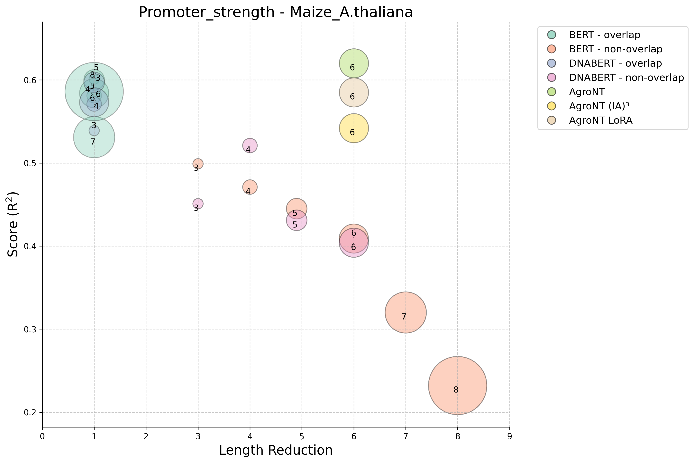
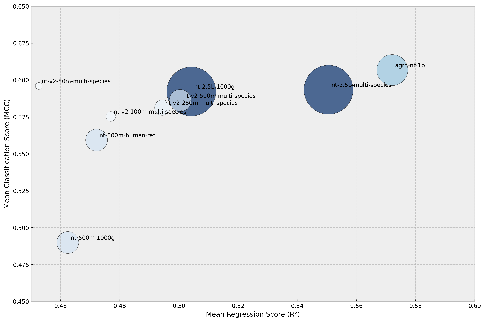

# BERT Models with k-mer Tokenization Strategies for Plant Genomic Prediction

> **Note**: This research is currently under review.

## Overall

This repository contains the code and resources for our research on optimizing BERT models for plant genomic prediction tasks. We explore the potential of in-domain, small-scale pre-trained models coupled with optimized k-mer tokenization strategies to develop models that achieve accuracy comparable to that of large-scale models while requiring significantly fewer computational resources.

## Exp.1: Kmer tokenization strategy (BERT) 

## Exp.2: Evaluate nt/ntv2/agront on plant-genomic-benchmark

